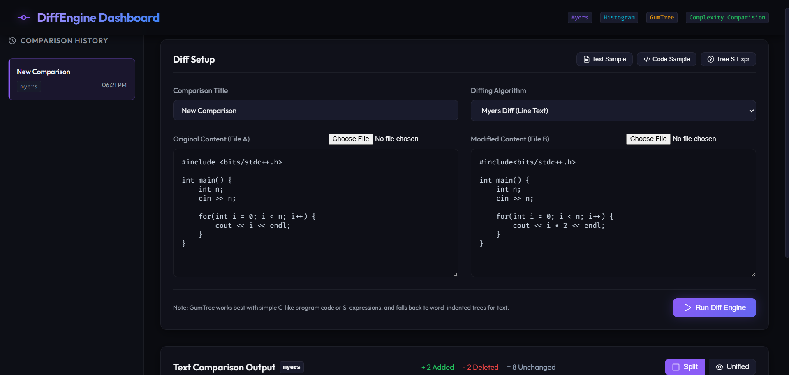
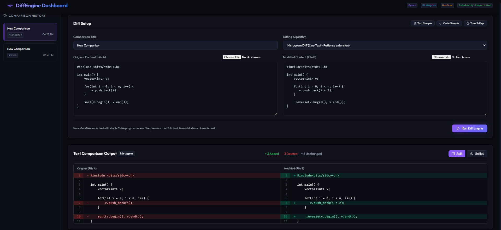
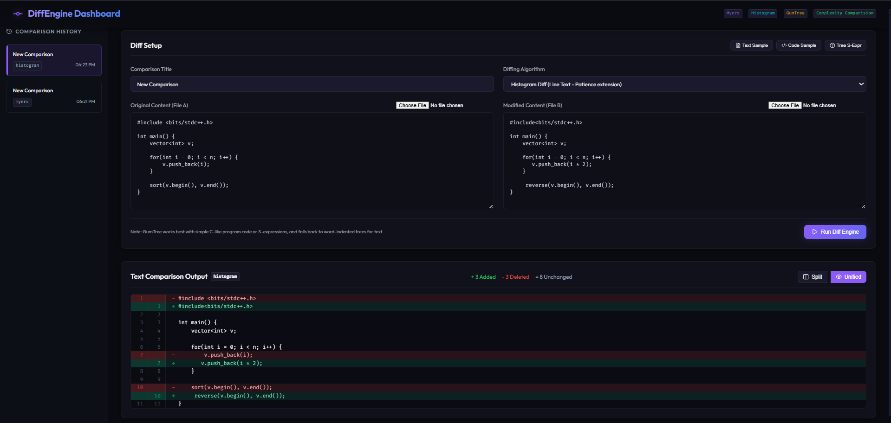
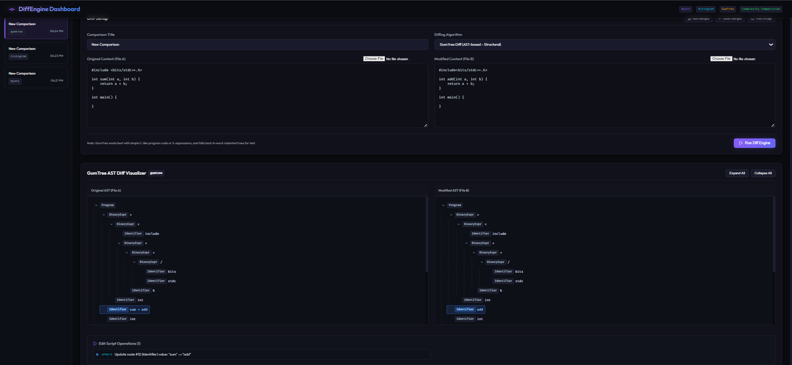
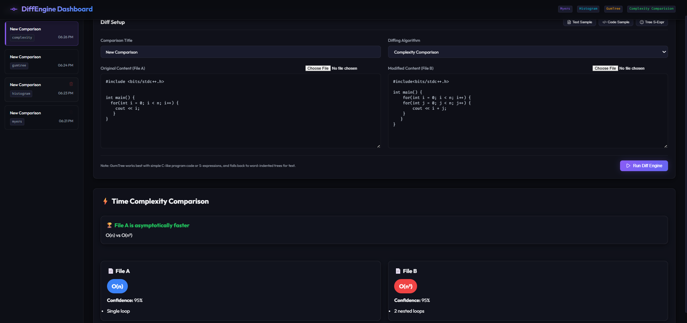

# DiffTools Dashboard (MERN + C++ Core)

A high-performance software analysis workspace combining a **C++ Diff Core** with a **MERN Stack Dashboard** for visual code comparison, structural analysis, complexity estimation, and comparison history tracking.

The platform integrates multiple state-of-the-art differencing approaches:

* **Myers Diff** for minimal edit scripts
* **Histogram Diff** for human-readable code reviews
* **GumTree AST Diff** for structural code analysis
* **Complexity Estimation Engine** for asymptotic runtime comparison

---

## Key Features

### 1. Myers Diff Algorithm

Line-based greedy path-finding on the edit graph.

* Minimal edit script generation
* O(ND) complexity
* Excellent for precise text differencing

### 2. Histogram Diff Algorithm

Git-style patience-extension diffing.

* Anchors on unique and rare lines
* Produces highly readable diffs
* Better visual grouping of edits

### 3. GumTree AST Diff Algorithm

Structural differencing using Abstract Syntax Trees.

Supports:

* Insertions
* Deletions
* Updates
* Node Moves

Parses:

* Simple C-like source code
* Lisp-style S-expressions

Uses top-down and bottom-up tree matching to identify structural changes.

### 4. Interactive Visualization Dashboard

* Split View
* Unified View
* Side-by-side comparison
* Color-coded change highlighting
* AST tree visualization
* Diff statistics summary

### 5. Complexity Estimation & Comparison

Heuristic-based static analysis engine capable of estimating:

| Complexity |
| ---------- |
| O(1)       |
| O(log n)   |
| O(√n)      |
| O(n)       |
| O(n log n) |
| O(n²)      |
| O(n³)      |
| O(2^n)     |

Detected patterns include:

* Single loops
* Nested loops
* Logarithmic loops (`i *= 2`, `n /= 2`)
* Square-root traversals
* Sorting algorithms
* Binary Search
* Recursive algorithms
* Graph Traversals (BFS / DFS)
* Disjoint Set Union (DSU)
* Segment Trees

The dashboard displays:

* Estimated complexity
* Confidence score
* Detection reasoning
* Side-by-side complexity comparison
* Complexity verdicts

### 6. Comparison History

* MongoDB persistence
* Reload previous comparisons
* Delete stored comparisons
* Automatic in-memory fallback when MongoDB is unavailable

---

## Technology Stack

### Backend

* Node.js
* Express.js
* MongoDB
* Mongoose
* C++14 Diff Engine

### Frontend

* React
* Vite
* CSS (Glassmorphism UI)

### Core Algorithms

* Myers Diff
* Histogram Diff
* GumTree AST Diff
* Complexity Estimation Engine

---

## Project Architecture

```text
Frontend (React + Vite)
        │
        ▼
Backend API (Express)
        │
        ▼
C++ Diff Engine
 ├── Myers
 ├── Histogram
 └── GumTree
        │
        ▼
MongoDB Storage
```

---

---

## Screenshots

### Main Dashboard



The primary workspace featuring history tracking, code editors, algorithm selection, diff statistics, and visualization modes.

---

### Text Differencing (Myers / Histogram)





Line-based comparison with split and unified views, highlighting additions, deletions, and unchanged content.

---

### GumTree AST Diff



Structural code analysis using Abstract Syntax Trees to detect updates, insertions, deletions, and node movements.

---

### Complexity Comparison



Heuristic-based asymptotic complexity estimation with confidence scores, reasoning, and side-by-side comparison.

---

## Directory Structure

```text
diffproject/
├── backend/
│   ├── models/
│   │   └── Comparison.js
│   │
│   ├── src/
│   │   ├── diff_core.h
│   │   ├── myers.cpp
│   │   ├── histogram.cpp
│   │   ├── ast.h
│   │   ├── ast.cpp
│   │   ├── gumtree.cpp
│   │   └── main.cpp
│   │
│   ├── temp/
│   ├── package.json
│   ├── server.js
│   └── diff_engine.exe
│
├── frontend/
│   ├── src/
│   │   ├── components/
│   │   │   ├── DiffViewer.jsx
│   │   │   ├── ASTDiffViewer.jsx
│   │   │   └── ComplexityViewer.jsx
│   │   │
│   │   ├── App.jsx
│   │   ├── index.css
│   │   └── main.jsx
│   │
│   └── package.json
│
└── README.md
```

---

## Setup & Running Instructions

### 1. Compile the C++ Diff Engine

```bash
g++ -O3 -std=c++14 backend/src/main.cpp backend/src/myers.cpp backend/src/histogram.cpp backend/src/ast.cpp backend/src/gumtree.cpp -o backend/diff_engine.exe
```

---

### 2. Start MongoDB

Ensure MongoDB is running locally:

```bash
mongod
```

Default connection:

```text
mongodb://127.0.0.1:27017/diffproject
```

If MongoDB is unavailable, the application automatically switches to in-memory history storage.

---

### 3. Start Backend Server

```bash
cd backend
npm install
node server.js
```

Backend URL:

```text
http://localhost:5000
```

---

### 4. Start Frontend Dashboard

```bash
cd frontend
npm install
npm run dev
```

Frontend URL:

```text
http://localhost:5173
```

---

## Supported Analysis Modes

| Mode                  | Description                                  |
| --------------------- | -------------------------------------------- |
| Myers                 | Minimal edit script text differencing        |
| Histogram             | Human-readable code differencing             |
| GumTree               | AST-based structural differencing            |
| Complexity Comparison | Runtime complexity estimation and comparison |

---

## Example Use Cases

### Code Review

Compare two source files using:

* Myers Diff
* Histogram Diff

to identify textual modifications.

### Refactoring Analysis

Use GumTree AST Diff to detect:

* Function moves
* Structural updates
* Node insertions/deletions

### Algorithm Optimization

Compare two implementations and estimate:

```text
O(n²) → O(n log n)
```

or

```text
O(n) → O(log n)
```

using the Complexity Comparison dashboard.

---

## Future Improvements

* Word-level differencing
* Space complexity estimation
* Syntax highlighting
* Language-specific parsers
* Complexity visualization graphs
* Export reports (PDF/JSON)
* Git repository integration

---

## License

This project is intended for educational, research, and software engineering learning purposes.
